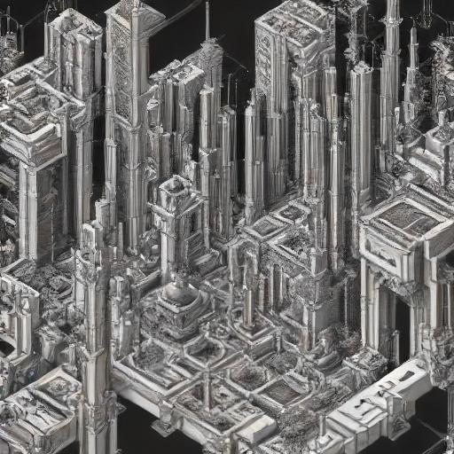

---  
title: Dashboard  
aliases:  
  - Dashboard  
cssclasses:  
  - cards  
---  
  
  
# Meta  
## Purpose  
This converges principles from many ideas. I use principles from zettlekasten, second brain, digital gardens and blogs. [^1] It's a place to practice writing and for me to follow my interests in a public space.   
  
  
There are many ways to *traverse* the connected notes. You can search by pressing `ctrl + k` or you can use the file explorer. There is also a graph view which shows the connections between the notes.  
  
  
I'll be using it to develop my [mental representations](./Areas/General/mental%20representations.md) of different topics I learn from literature, videos and podcasts. Not all of these notes will be complete, or publicly available. There are no transient notes in this system. Digital gardens are places where notes and writing grows over time. A seed, an idea, it grows over time - the idea takes root. As those roots grow and connect to others, it becomes part of a larger network.  
  
  
Notes are written in draft format and shared without proper revision. I will revisit topics and notes, I'll be practicing writing by rewriting - revising and developing notes. Notes will be linked to relevant notes to be able to jump through trains of thought. These notes will grow as they form part of the knowledge network. Some of the notes will become very polished and will stand on their own as well research articles - which is what most digital gardeners call an "evergreen" note. Evergreen notes are curated and extensively linked notes.   
  
My hope is that as I get better at web development - and accumulate ideas and references - that I will inspire others to begin their own self-learning journey. I hope that I will spark creativity or interest in a topic that can feed curiosity - all the resources will be right here! I believe that we live in an opportune time for learning and developing our own interests. May are fortunate to have access to all the learning resources they need to develop their abilities in any area. Never before has there been greater access to the internet. There are thousands of free resources and cheap books with knowledge abounds out there for all kinds of interests. The problem is that with all these developments of technology, also comes distraction. The same tools that have given us the freedom to learn and acquire knowledge are also the things which distract us.   
  
So, I say, why not see and understand as much as we can. Try and open our minds up to various ideas and take in all that is out there. I hope that this digital garden, at its worst will be a place for me to develop my interests but at its best will inspire others to join in those interests and perhaps dive into it themselves.  
  
## Types of notes  
I use tags to classify note types:  
- **Topic** - topics will be linking lists to notes which all relate to the same topic (e.g [Philosophy](./Areas/General/Philosophy.md)).  
- **Atomic note** - Similar to zettlekasten methods,[^4] I will try to distill notes into smaller ideas. These notes will link to a reference that provides where I got the information from.   
- **Essays** - essay notes are long-form content. I write these notes "stream of consciousness" style. I take a single idea and follow it. I write about partly things that I know and partly my own opinion.    
  
## Inspiration  
Some inspiration for this site and where i hope it to get to in terms of design and writing:  
- Andy Matuschak - [see here](https://notes.andymatuschak.org)  
- Gwern - [see here](https://gwern.net)  
- Azlen Elza - [see here](https://azlen.me)  
- less wrong blog - [see here](https://Lesswrong.com)  
- 100 rabbits - [see here](https://100r.co)  
- from jason- [see here](https://fromjason.xyz)  
- bager Bach- [See here](https://bagerbach.com)  
## Design principles  
In its early stages, this website will primarily be a representation of notes of my interests but as it develops, I intent it to be a learning and academic resource. Some things I will adhere to:  
- **Multiple jump in points** - I want there to be multiple ways to jump into this website and learn something new. That's why there is a variety of ways to explore this site via tags, folders and maps of content. I hope that as the site grows, there will be others.[^3]  
- **Exportability** - I want to implement ways of exporting the data from this website as pdf's, emailing newsletters on updates and other ways of taking the information into the reader's own hands. I don't want to lock any of the information from this site onto the site. I believe knowledge should be for everyone and should be as transportable and portable as possible.  
- **Notes that grow** - I want topics to grow and for their references to grow. Once a topic becomes well connected enough, I will write an overarching breakdown of it. This will mean that notes will have a bottom up approach hierarchy. Notes will be able to stand on their own as atomic notes. They will be appropriately linked to topics they are relevant to (and themes which are less relevant or siblings).   
- **A place to put what I want to remember** - The way I integrate these notes in the system already includes many techniques which reinforce learning. I am constantly revisiting, rediscovering and refactoring what I learn so that I am forced to view the information in many different contexts.   
- **Writing for me** - The notes I write will be ones I think are useful. I'll avoid collecting notes just for collecting or sharing's sake.  
  
# Top of mind  
A topic which is "top of mind" is one which I am currently looking into actively. They're the ones that I want to see expand the most right now and are likely to change.   
- [Web design](Web%20design.md)  
	- [Javascript](Javascript.md)  
	- [CSS](./Areas/General/CSS.md)  
- [Josh digital garden](Josh%20digital%20garden.md)  
## Bookshelf  
My bookshelf is where you can see what I'm currently reading and what I've finished. When I finish a book, I try to write a summary of its core ideas. Each book note will link to any literature notes which contain highlights. If any atomic notes or quotes have been saved from those literature notes, they can be seen in the book notes.[^2]  
  
> [!NOTE]- Bookshelf  
>  | Cover                                                                                                                             | Title                                                                                                                                                                                                 | author                                                                                  | Total Pages | Status  |  
> | --------------------------------------------------------------------------------------------------------------------------------- | ----------------------------------------------------------------------------------------------------------------------------------------------------------------------------------------------------- | --------------------------------------------------------------------------------------- | ----------- | ------- |  
> |  | [A Pale View of Hills - Kazuo Ishiguro](./Areas/Books/A%20Pale%20View%20of%20Hills%20-%20Kazuo%20Ishiguro.md)                                                                                                       | <ul><li>Kazuo Ishiguro</li></ul>                                                        | 175         | reading |  
> |  | [Make It Stick - Peter C Brown Henry L Roediger III Mark A McDaniel](./Areas/Books/Make%20It%20Stick%20-%20Peter%20C%20Brown%20Henry%20L%20Roediger%20III%20Mark%20A%20McDaniel.md)                                             | <ul><li>Peter C. Brown</li><li>Henry L. Roediger III</li><li>Mark A. McDaniel</li></ul> | 330         | reading |  
> |            | [On Writing Well - William Zinsser](./Areas/Books/On%20Writing%20Well%20-%20William%20Zinsser.md)                                                                                                               | <ul><li>William Zinsser</li></ul>                                                       | 318         | reading |  
> |  | [1984 - George Orwell](./Areas/Books/1984%20-%20George%20Orwell.md)                                                                                                                                         | <ul><li>George Orwell</li></ul>                                                         | 309         | read    |  
> |  | [Animal Farm - George Orwell](./Areas/Books/Animal%20Farm%20-%20George%20Orwell.md)                                                                                                                           | <ul><li>George Orwell</li></ul>                                                         | 105         | read    |  
> |            | [Atomic Habits - James Clear](./Areas/Books/Atomic%20Habits%20-%20James%20Clear.md)                                                                                                                           | <ul><li>James Clear</li></ul>                                                           | 321         | read    |  
> |            | [Beyond Good and Evil - Friedrich Wilhelm Nietzsche](./Areas/Books/Beyond%20Good%20and%20Evil%20-%20Friedrich%20Wilhelm%20Nietzsche.md)                                                                             | <ul><li>Friedrich Wilhelm Nietzsche</li></ul>                                           | 294         | read    |  
> |            | [Dune - Frank Herbert](./Areas/Books/Dune%20-%20Frank%20Herbert.md)                                                                                                                                         | <ul><li>Frank Herbert</li></ul>                                                         | 577         | read    |  
> |            | [Flowers for Algernon - Daniel Keyes](./Areas/Books/Flowers%20for%20Algernon%20-%20Daniel%20Keyes.md)                                                                                                           | <ul><li>Daniel Keyes</li></ul>                                                          | 321         | read    |  
> |            | [Frankenstein Or The Modern Prometheus - Mary Wollstonecraft Shelley Percy Bysshe Shelley](./Areas/Books/Frankenstein%20Or%20The%20Modern%20Prometheus%20-%20Mary%20Wollstonecraft%20Shelley%20Percy%20Bysshe%20Shelley.md) | <ul><li>Mary Wollstonecraft Shelley</li><li>Percy Bysshe Shelley</li></ul>              | 456         | read    |  
> |  | [Make Every Word Count - Gary Provost](./Areas/Books/Make%20Every%20Word%20Count%20-%20Gary%20Provost.md)                                                                                                         | <ul><li>Gary Provost</li></ul>                                                          | 300         | read    |  
> |  | [Man's Search For Meaning - Viktor E Frankl](./Areas/Books/Man's%20Search%20For%20Meaning%20-%20Viktor%20E%20Frankl.md)                                                                                             | <ul><li>Viktor E Frankl</li></ul>                                                       | 240         | read    |  
> |  | [Meditations - Aurelius Marcus](./Areas/Books/Meditations%20-%20Aurelius%20Marcus.md)                                                                                                                       | <ul><li>Aurelius Marcus</li></ul>                                                       | 228         | read    |  
> |            | [On Writing - Stephen King](./Areas/Books/On%20Writing%20-%20Stephen%20King.md)                                                                                                                               | <ul><li>Stephen King</li></ul>                                                          | 108         | read    |  
> |  | [Peak - Anders Ericsson, Robert Pool](./Areas/Books/Peak%20-%20Anders%20Ericsson,%20Robert%20Pool.md)                                                                                                           | <ul><li>Anders Ericsson</li><li>Robert Pool</li></ul>                                   | 338         | read    |  
> |            | [The Dispossessed - Ursula K Le Guin](./Areas/Books/The%20Dispossessed%20-%20Ursula%20K%20Le%20Guin.md)                                                                                                           | <ul><li>Ursula K. Le Guin</li></ul>                                                     | 0           | read    |  
> |            | [The Handmaid's Tale - Margaret Atwood](./Areas/Books/The%20Handmaid's%20Tale%20-%20Margaret%20Atwood.md)                                                                                                       | <ul><li>Margaret Atwood</li></ul>                                                       | 325         | read    |  
> |  | [The Importance of Being Earnest - Oscar Wilde](./Areas/Books/The%20Importance%20of%20Being%20Earnest%20-%20Oscar%20Wilde.md)                                                                                       | <ul><li>Oscar Wilde</li></ul>                                                           | 86          | read    |  
> |  | [The Left Hand Of Darkness - Ursula K Le Guin](./Areas/Books/The%20Left%20Hand%20Of%20Darkness%20-%20Ursula%20K%20Le%20Guin.md)                                                                                         | <ul><li>Ursula K. Le Guin</li></ul>                                                     | 222         | read    |  
> |  | [The Myth of Sisyphus - Albert Camus](./Areas/Books/The%20Myth%20of%20Sisyphus%20-%20Albert%20Camus.md)                                                                                                           | <ul><li>Albert Camus</li></ul>                                                          | 211         | read    |  
> |  | [The Sailor who Fell from Grace with the Sea - Yukio Mishima](./Areas/Books/The%20Sailor%20who%20Fell%20from%20Grace%20with%20the%20Sea%20-%20Yukio%20Mishima.md)                                                           | <ul><li>Yukio Mishima</li></ul>                                                         | 144         | read    |  
> |            | [The Stars My Destination - Alfred Bester](./Areas/Books/The%20Stars%20My%20Destination%20-%20Alfred%20Bester.md)                                                                                                 | <ul><li>Alfred Bester</li></ul>                                                         | 244         | read    |  
> |            | [The Stranger - Albert Camus](./Areas/Books/The%20Stranger%20-%20Albert%20Camus.md)                                                                                                                           | <ul><li>Albert Camus</li></ul>                                                          | 144         | read    |  
> |  | [How to Take Smart Notes - Sönke Ahrens](./Areas/Books/How%20to%20Take%20Smart%20Notes%20-%20S%C3%B6nke%20Ahrens.md)                                                                                                     | <ul><li>Sönke Ahrens</li></ul>                                                          | 212         | \-      |  
>   
  
## Literature notes  
Literature notes are the highlights and quotes that are extracted from my e-ink reader (Kobo Libra 2 running KoReader). When I highlight passages in a book, I highlight them because I want to remember some of that content or they seem important at the time. I don't always then use the ideas that I've highlighted in my book notes. A passage that seemed significant may not be upon rereading. When I've made a book note out of the literature notes, I mark it completed as indicated in the tables below:  
### Book notes  
  
> [!SUMMARY]- Fiction  
>  | Title                                                                                                  | Date imported  | Author                              |  
> | ------------------------------------------------------------------------------------------------------ | -------------- | ----------------------------------- |  
> | [Ursla K Le Guin - The Dispossessed](./Literature%20notes/Ursla%20K%20Le%20Guin%20-%20The%20Dispossessed.md)         | March 23, 2024 | <ul><li>Ursula K. Le Guin</li></ul> |  
> | [Ernest Hemingway - Old Man and the Sea](./Literature%20notes/Ernest%20Hemingway%20-%20Old%20Man%20and%20the%20Sea.md) | March 23, 2024 | <ul><li>Ernest Hemingway</li></ul>  |  
> | [Daniel Keyes - Flowers for Algernon](./Literature%20notes/Daniel%20Keyes%20-%20Flowers%20for%20Algernon.md)       | March 23, 2024 | <ul><li>Daniel Keyes</li></ul>      |  
> | [Yoel Hoffman - Japanese Death Poems](./Literature%20notes/Yoel%20Hoffman%20-%20Japanese%20Death%20Poems.md)       | \-             | \-                                  |  
>   
  
> [!SUMMARY]- Non-fiction  
>  | Title                                                                                                                    | Date imported  | Author                                             |  
> | ------------------------------------------------------------------------------------------------------------------------ | -------------- | -------------------------------------------------- |  
> | [Stephen King - On Writing A Memoir of the Craft](./Literature%20notes/Stephen%20King%20-%20On%20Writing%20A%20Memoir%20of%20the%20Craft.md) | May 16, 2024   | <ul><li>Stephen King</li></ul>                     |  
> | [Anderss Ericsson and Robert Pool - Peak](./Literature%20notes/Anderss%20Ericsson%20and%20Robert%20Pool%20-%20Peak.md)                 | April 18, 2024 | <ul><li>Anderss Ericsson and Robert Pool</li></ul> |  
> | [Miyamoto Musashi - 21 principles of Dokkodo](./Literature%20notes/Miyamoto%20Musashi%20-%2021%20principles%20of%20Dokkodo.md)         | April 09, 2024 | <ul><li>Miyamoto Musashi</li></ul>                 |  
> | [Victor E Frankl - Mans Search For Meaning](./Literature%20notes/Victor%20E%20Frankl%20-%20Mans%20Search%20For%20Meaning.md)             | March 23, 2024 | <ul><li>Victor E Frankl</li></ul>                  |  
> | [Seneca - Letters from a Stoic](./Literature%20notes/Seneca%20-%20Letters%20from%20a%20Stoic.md)                                     | March 23, 2024 | <ul><li>Seneca</li></ul>                           |  
> | [Marcus Aurelius - Meditations](./Literature%20notes/Marcus%20Aurelius%20-%20Meditations.md)                                     | March 23, 2024 | <ul><li>Marcus Aurelius</li></ul>                  |  
> | [Kate Murphy - You're Not Listening](./Literature%20notes/Kate%20Murphy%20-%20You're%20Not%20Listening.md)                           | March 23, 2024 | <ul><li>Kate Murphy</li></ul>                      |  
> | [Helen Fisher - Why We Love](./Literature%20notes/Helen%20Fisher%20-%20Why%20We%20Love.md)                                           | March 23, 2024 | <ul><li>Helen Fisher</li></ul>                     |  
> | [Mortimer J Adler - How to Read a Book](./Literature%20notes/Mortimer%20J%20Adler%20-%20How%20to%20Read%20a%20Book.md)                     | \-             | <ul><li>Mortimer J Adler</li></ul>                 |  
> | [James Clear - Atomic Habits](./Literature%20notes/James%20Clear%20-%20Atomic%20Habits.md)                                         | \-             | James Clear                                        |  
>   
  
## Topics explored  
These are the topics and themes which I have explored in my learning or writing. Topics are strong have strong connections to their notes. Themes are lesser but nonetheless still relevant connections.   
  
> [!EXAMPLE]- Topics  
>  |                                                                                   | Mentions |  
> | --------------------------------------------------------------------------------- | -------- |  
> | [Absurdity](Absurdity.md)                                                          | 2        |  
> | [AI](AI.md)                                                                        | 1        |  
> | [Anarchy](Anarchy.md)                                                              | 1        |  
> | [arch linux](arch%20linux.md)                                                        | 2        |  
> | [Cognition](./Areas/General/Cognition.md)                                         | 1        |  
> | [CSS](./Areas/General/CSS.md)                                                     | 16       |  
> | [html](./Areas/General/html.md)                                                   | 6        |  
> | [Learning](./Areas/General/Learning.md)                                           | 11       |  
> | [logotherapy](./Areas/General/logotherapy.md)                                     | 1        |  
> | [personal knowledge management](./Areas/General/personal%20knowledge%20management.md) | 2        |  
> | [Philosophy](./Areas/General/Philosophy.md)                                       | 17       |  
> | [Psychology](./Areas/General/Psychology.md)                                       | 5        |  
> | [Writing](./Areas/General/Writing.md)                                             | 8        |  
> | [Givers and receivers](./Areas/Ideas/Givers%20and%20receivers.md)                     | 1        |  
> | [blogging](blogging.md)                                                            | 2        |  
> | [Collective unconscious](Collective%20unconscious.md)                                | 1        |  
> | [digital garden](digital%20garden.md)                                                | 1        |  
> | [Empathy](Empathy.md)                                                              | 1        |  
> | [Enlightenment](Enlightenment.md)                                                  | 1        |  
> | [exercise](exercise.md)                                                            | 1        |  
> | [habits](habits.md)                                                                | 2        |  
> | [Human condition](Human%20condition.md)                                              | 2        |  
> | [Javascript](Javascript.md)                                                        | 2        |  
> | [linux](linux.md)                                                                  | 1        |  
> | [Listening](Listening.md)                                                          | 1        |  
> | [Music](Music.md)                                                                  | 1        |  
> | [neurology](neurology.md)                                                          | 4        |  
> | [note taking](note%20taking.md)                                                      | 2        |  
> | [Obsidian](Obsidian.md)                                                            | 1        |  
> | [patience](patience.md)                                                            | 1        |  
> | [Perception](Perception.md)                                                        | 2        |  
> | [perseverance](perseverance.md)                                                    | 1        |  
> | [Poetry](Poetry.md)                                                                | 1        |  
> | [Reading](Reading.md)                                                              | 3        |  
> | [science fiction](science%20fiction.md)                                              | 2        |  
> | [second brain](second%20brain.md)                                                    | 1        |  
> | [Server](Server.md)                                                                | 1        |  
> | [Social psychology](Social%20psychology.md)                                          | 1        |  
> | [Social science](Social%20science.md)                                                | 1        |  
> | [stoicism](stoicism.md)                                                            | 3        |  
> | [Taoism](Taoism.md)                                                                | 1        |  
> | [Templater](Templater.md)                                                          | 1        |  
> | [Web design](Web%20design.md)                                                        | 7        |  
> | [zettlekasten](zettlekasten.md)                                                    | 1        |  
>   
  
> [!TIP]- Themes  
>  |                                                                                   |  
> | --------------------------------------------------------------------------------- |  
> | [aggregation of marginal gains](aggregation%20of%20marginal%20gains.md)                  |  
> | [Two minds](./Areas/Essays/Two%20minds.md)                                          |  
> | [CSS box model](./Areas/General/CSS%20box%20model.md)                                 |  
> | [CSS cascade](./Areas/General/CSS%20cascade.md)                                     |  
> | [CSS selectors](./Areas/General/CSS%20selectors.md)                                 |  
> | [CSS specificity](./Areas/General/CSS%20specificity.md)                             |  
> | [CSS](./Areas/General/CSS.md)                                                     |  
> | [Deliberate practice](./Areas/General/Deliberate%20practice.md)                     |  
> | [HTML inline vs block elements](./Areas/General/HTML%20inline%20vs%20block%20elements.md) |  
> | [html](./Areas/General/html.md)                                                   |  
> | [logotherapy](./Areas/General/logotherapy.md)                                     |  
> | [mental representations](./Areas/General/mental%20representations.md)               |  
> | [Purposeful practice](./Areas/General/Purposeful%20practice.md)                     |  
> | [blogging](blogging.md)                                                            |  
> | [databases](databases.md)                                                          |  
> | [digital garden](digital%20garden.md)                                                |  
> | [existentialism](existentialism.md)                                                |  
> | [Fonts](Fonts.md)                                                                  |  
> | [habits linked to identity](habits%20linked%20to%20identity.md)                          |  
> | [haikus](haikus.md)                                                                |  
> | [Javascript](Javascript.md)                                                        |  
> | [Love](Love.md)                                                                    |  
> | [note taking](note%20taking.md)                                                      |  
> | [Rider and the elephant](Rider%20and%20the%20elephant.md)                                |  
> | [second brain](second%20brain.md)                                                    |  
> | [self-improvement](self-improvement.md)                                            |  
> | [social commentary](social%20commentary.md)                                          |  
> | [stoicism](stoicism.md)                                                            |  
> | [systemd](systemd.md)                                                              |  
> | [Tanka](Tanka.md)                                                                  |  
> | [use systems not goals](use%20systems%20not%20goals.md)                                  |  
> | [virtue](virtue.md)                                                                |  
> | [VS code](VS%20code.md)                                                              |  
> | [What matters](What%20matters.md)                                                    |  
> | [writing exercise](writing%20exercise.md)                                            |  
>   
  
  
[^1]: Second brains are popularised by Tiago Forte and are organised typically with his P.A.R.A method. Digital gardens are unorganized online notes that function similarly to blogs but have a less polished feel to it.  
[^2]: For example, see [Peak - Anders Ericsson, Robert Pool](./Areas/Books/Peak%20-%20Anders%20Ericsson,%20Robert%20Pool.md).  
[^3]: Users can view this website through the graph view to see how everything links; users can view by tags by clicking them or searching, there is a search bar to search keywords and you can view folders.  
[^4]: Zettlekasten is a note taking method developed by Nickolas Luhhman. He proposed that notes should be distilled and separated into individual digestable ideas. These notes are called "atomic notes" which is a term used in [How to Take Smart Notes - Sönke Ahrens](./Areas/Books/How%20to%20Take%20Smart%20Notes%20-%20S%C3%B6nke%20Ahrens.md).